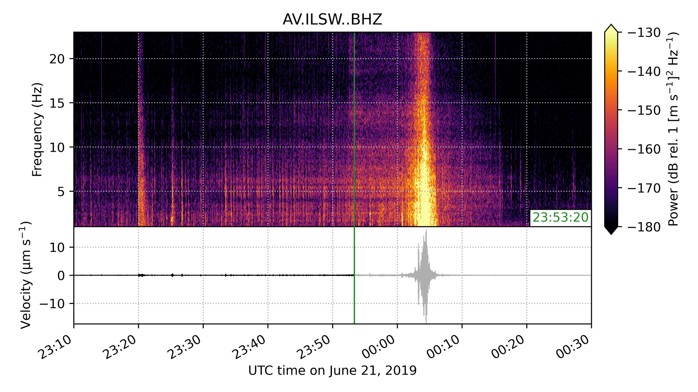

sonify
======

|badge|

This tool “squeezes” seismic or infrasound signals into audible frequencies and
creates animated spectrograms to accompany the audio. Data are pulled from the
`IRIS DMC <https://ds.iris.edu/ds/nodes/dmc/>`__.

|screenshot|

Quickstart
----------

1. Prepare environment

   ::

      conda create -n sonify -c conda-forge colorcet ffmpeg obspy
      conda activate sonify

2. Obtain and install

   ::

      git clone https://github.com/liamtoney/sonify.git
      cd sonify
      pip install -e .

3. Run

   .. code:: python

      python
      >>> from sonify import sonify

Example
-------

To make a movie of the seismic signal generated by a massive avalanche
occurring in Alaska on 21 June 2019, sped up by a factor of 200:

.. ~BEGIN~
.. code:: python

   from sonify import sonify
   from obspy import UTCDateTime

   sonify(
       network='AV',
       station='ILSW',
       channel='BHZ',
       starttime=UTCDateTime(2019, 6, 20, 23, 10),
       endtime=UTCDateTime(2019, 6, 21, 0, 30),
       freqmin=1,
       freqmax=23,
       speed_up_factor=200,
       fps=1,  # Use fps=60 to fully recreate the JHEPC entry (slow to save!)
       spec_win_dur=8,
       db_lim=(-180, -130),
   )
.. ~END~

The result is a 4K 1fps video file named ``AV_ILSW_BHZ_200x.mp4``. A screenshot
of the movie is shown at the top of this README.

Documentation
-------------

API documentation for the module is available
`here <https://sonify.readthedocs.io/en/latest/sonify.html>`__.

.. |badge| image:: https://readthedocs.org/projects/sonify/badge/?version=latest
   :target: https://sonify.readthedocs.io/

