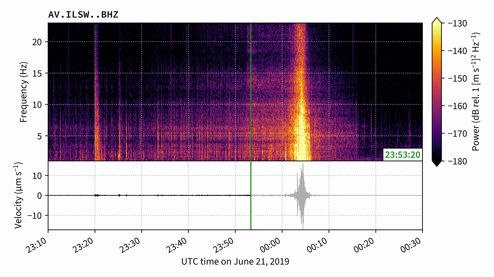

sonify
======

|image0|

This tool “squeezes” seismic or infrasound signals into audible
frequencies and creates animated spectrograms to accompany the audio.
Data are pulled from the `IRIS
DMC <https://ds.iris.edu/ds/nodes/dmc/>`__.

|image1|

Quickstart
----------

1. Prepare environment

   ::

      conda create -n sonify -c conda-forge colorcet ffmpeg obspy
      conda activate sonify

2. Obtain and install

   ::

      git clone https://github.com/liamtoney/sonify.git
      cd sonify
      pip install -e .

3. Run

   .. code:: python

      python
      >>> from sonify import sonify

Example
-------

To make a movie of the infrasound signal generated by a massive
avalanche occurring in Alaska on 22 May 2016, sped up by a factor of
400:

.. code:: python

   from sonify import sonify
   from obspy import UTCDateTime

   sonify(
       network='TA',
       station='O20K',
       channel='BDF',
       starttime=UTCDateTime(2016, 5, 22, 7, 45),
       endtime=UTCDateTime(2016, 5, 22, 8, 15),
       speed_up_factor=400,
       fps=10,
       db_lim=(40, 100),
   )

The result is a 4K 10fps video file named ``TA_O20K_BDF_400x.mp4``. A
screenshot of the movie is shown at the top of this README.

Documentation
-------------

Full documentation is available
`here <https://sonify.readthedocs.io/>`__.

.. |image0| image:: https://readthedocs.org/projects/sonify/badge/?version=latest
   :target: https://sonify.readthedocs.io/

